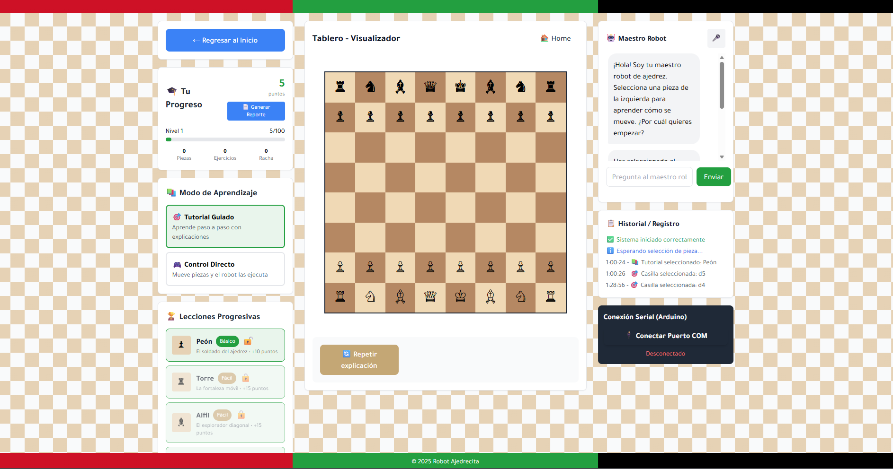
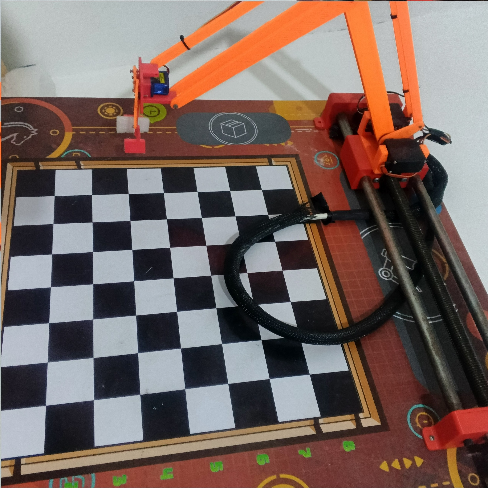

# ♟️ Brazo Ajedrecista Inteligente | Intelligent Robotic Chess Arm


---

🌐 **Language / Idioma:** [🇪🇸 Español](#-español) | [🇺🇸 English](#-english)

---

# 🇪🇸 Español

## 📌 Descripción

El Brazo Ajedrecista Inteligente es un sistema robótico diseñado para interactuar con un tablero físico de ajedrez, permitiendo el movimiento automatizado de piezas mediante un brazo robótico.

El proyecto integra robótica, visión por computadora, sistemas embebidos y desarrollo web para ofrecer una experiencia interactiva que combina tecnología, automatización y aprendizaje del ajedrez.

<p align="center">
  
</p>

---

## ✨ Características

* 🦾 Brazo robótico de 3 grados de libertad.
* ♟️ Movimiento automatizado de piezas de ajedrez.
* ⚡ Sistema de control basado en Arduino.
* 👁️ Visión por computadora mediante Python y OpenCV.
* 🌐 Interfaz web para la interacción con el sistema.
* 📐 Modelos 3D disponibles en formato STL.

---

## 🛠️ Tecnologías

| Categoría              | Tecnologías                                  |
| :--------------------- | :------------------------------------------- |
| Programación           | `C++`, `Python`, `JavaScript`, `HTML`, `CSS` |
| Backend                | `Node.js`, `Express.js`                      |
| Visión por computadora | `OpenCV`, `python-chess`                     |
| Hardware               | `Arduino`, servomotores, motor paso a paso   |
| Diseño CAD             | `Fusion 360`                                 |

---

## 🤖 Sistema Robótico

El sistema utiliza un brazo robótico diseñado para manipular piezas de ajedrez sobre un tablero físico.

Su estructura mecánica combina servomotores y un motor paso a paso, controlados mediante electrónica basada en Arduino.

<p align="center">
  
</p>

---

## 🧩 Modelos 3D

Los modelos tridimensionales del proyecto están disponibles en formato STL y se encuentran organizados en las siguientes carpetas:

| Directorio  | Contenido                                                       |
| :---------- | :-------------------------------------------------------------- |
| `STL/Arm/`  | Modelos 3D correspondientes al brazo robótico.                  |
| `STL/Claw/` | Modelos 3D correspondientes a la pinza o mecanismo de sujeción. |

Los archivos pueden utilizarse para visualización, referencia del diseño mecánico e impresión 3D.

---

## 🚀 Instalación y Configuración

### 📋 Requisitos

* Node.js y npm.
* Python 3.
* Arduino IDE.
* GTK3 Runtime: `gtk3-runtime-3.24.31-2022-01-04-ts-win64`.
* Hardware compatible con Arduino.

### 1. Clonar el repositorio

```bash
git clone https://github.com/AntonioPV14/Brazo-Ajedrecista.git
cd Brazo-Ajedrecista
```

### 2. Instalar las dependencias

```bash
npm install
```

También es necesario instalar las bibliotecas de Python requeridas por el módulo de visión por computadora.

### 3. Instalar GTK3 Runtime

Para ejecutar el sistema en Windows es necesario instalar el siguiente entorno de ejecución:

```text
gtk3-runtime-3.24.31-2022-01-04-ts-win64
```

Instala GTK3 Runtime antes de ejecutar los componentes que dependan de esta biblioteca.

### 4. Configurar Arduino

Abre los archivos correspondientes al sistema de control en Arduino IDE.

Selecciona la placa adecuada y verifica las conexiones del hardware antes de cargar el programa.

### 5. Ejecutar la aplicación

El servidor principal se encuentra en:

```text
server.js
```

Consulta `package.json` para conocer el comando configurado para iniciar la aplicación.

---

# 🇺🇸 English

## 📌 Description

The Intelligent Robotic Chess Arm is a robotic system designed to interact with a physical chessboard, allowing the automated movement of chess pieces using a robotic arm.

The project combines robotics, computer vision, embedded systems, and web development to provide an interactive experience focused on technology, automation, and chess learning.

<p align="center">
  
</p>

---

## ✨ Features

* 🦾 3-degree-of-freedom robotic arm.
* ♟️ Automated chess piece movement.
* ⚡ Arduino-based control system.
* 👁️ Computer vision using Python and OpenCV.
* 🌐 Web interface for system interaction.
* 📐 3D models available in STL format.

---

## 🛠️ Technologies

| Category        | Technologies                                 |
| :-------------- | :------------------------------------------- |
| Programming     | `C++`, `Python`, `JavaScript`, `HTML`, `CSS` |
| Backend         | `Node.js`, `Express.js`                      |
| Computer Vision | `OpenCV`, `python-chess`                     |
| Hardware        | `Arduino`, servo motors, stepper motor       |
| CAD Design      | `Fusion 360`                                 |

---

## 🤖 Robotic System

The system uses a robotic arm designed to manipulate chess pieces on a physical chessboard.

Its mechanical structure combines servo motors and a stepper motor, controlled through Arduino-based electronics.

<p align="center">
  
</p>

---

## 🧩 3D Models

The project's 3D models are available in STL format and are organized into the following directories:

| Directory   | Contents                                                   |
| :---------- | :--------------------------------------------------------- |
| `stl/Arm/`  | 3D models corresponding to the robotic arm.                |
| `stl/Claw/` | 3D models corresponding to the claw or gripping mechanism. |

The files can be used for visualization, mechanical design reference, and 3D printing.

---

## 🚀 Installation and Setup

### 📋 Requirements

* Node.js and npm.
* Python 3.
* Arduino IDE.
* GTK3 Runtime: `gtk3-runtime-3.24.31-2022-01-04-ts-win64`.
* Arduino-compatible hardware.

### 1. Clone the Repository

```bash
git clone https://github.com/AntonioPV14/Brazo-Ajedrecista.git
cd Brazo-Ajedrecista
```

### 2. Install Dependencies

```bash
npm install
```

The Python libraries required by the computer vision module must also be installed.

### 3. Install GTK3 Runtime

To run the system on Windows, the following runtime environment is required:

```text
gtk3-runtime-3.24.31-2022-01-04-ts-win64
```

Install GTK3 Runtime before running components that depend on this library.

### 4. Configure Arduino

Open the appropriate source files in Arduino IDE.

Select the correct board and verify the hardware connections before uploading the program.

### 5. Run the Application

The main server is located at:

```text
server.js
```

Refer to `package.json` for the configured command used to start the application.

---

## 📂 Repository Structure

```text
Brazo-Ajedrecista/
├── Arduino/
├── Vision/
├── js/
├── style/
├── tools/
├── views/
├── stl/
│   ├── Arm/
│   └── Claw/
├── img/
│   ├── sis.png
│   └── arm.jpg
├── index.html
├── server.js
├── package.json
├── LICENSE
└── README.md
```

---

## 📄 License | Licencia

This project is licensed under the MIT License.

Este proyecto está distribuido bajo la Licencia MIT.

See the [`LICENSE`](LICENSE.txt) file for the complete license terms.

---

## 👨‍💻 Author | Autor

Antonio José Perozo Valbuena

Systems Engineering | Software Development | Robotics

GitHub: [@AntonioPV14](https://github.com/AntonioPV14)
